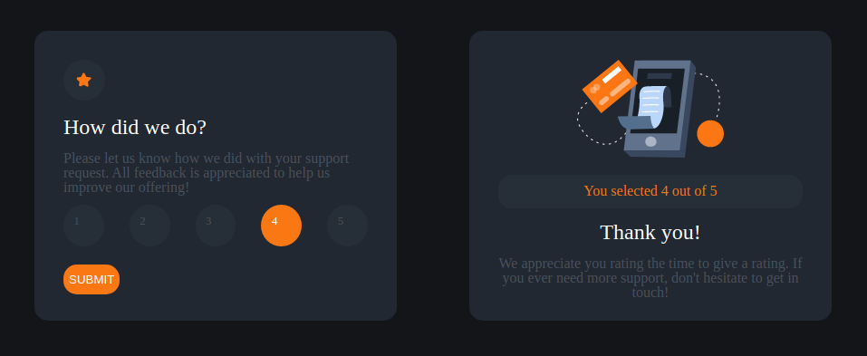

# Frontend Mentor - Interactive rating component solution

This is a solution to the [Interactive rating component challenge on Frontend Mentor](https://www.frontendmentor.io/challenges/interactive-rating-component-koxpeBUmI). Frontend Mentor challenges help you improve your coding skills by building realistic projects. 

## Table of contents

- [Frontend Mentor - Interactive rating component solution](#frontend-mentor---interactive-rating-component-solution)
  - [Table of contents](#table-of-contents)
  - [Overview](#overview)
    - [The challenge](#the-challenge)
    - [Screenshot](#screenshot)
    - [Links](#links)
  - [My process](#my-process)
    - [Built with](#built-with)
    - [What I learned](#what-i-learned)
  - [Author](#author)


**Note: Delete this note and update the table of contents based on what sections you keep.**

## Overview

### The challenge

Users should be able to:

- View the optimal layout for the app depending on their device's screen size
- See hover states for all interactive elements on the page
- Select and submit a number rating
- See the "Thank you" card state after submitting a rating

### Screenshot




### Links

- Solution URL: https://github.com/Nicolas-Verbaere/Frontend_Mentor_interactive-rating-component
- Live Site URL: https://nicolas-verbaere.github.io/Frontend_Mentor_interactive-rating-component/

## My process

First I create the HTML, and I add style CSS.
After, I trying to create a Express Server and use JSX to boost the page.
But it dont work that I expected, so I decide to use only front.


### Built with

- Semantic HTML5 markup
- CSS custom properties
- Flexbox
- CSS Grid

### What I learned

I learn a lot with thi exercise.
- How to use DOM, especialy 
``` JS
document.querySelector(".button") 
```
- How to add style to button radio
- and more


## Author

- Frontend Mentor - [@Nicolas-Verbaere](https://www.frontendmentor.io/profile/Nicolas-Verbaere)

